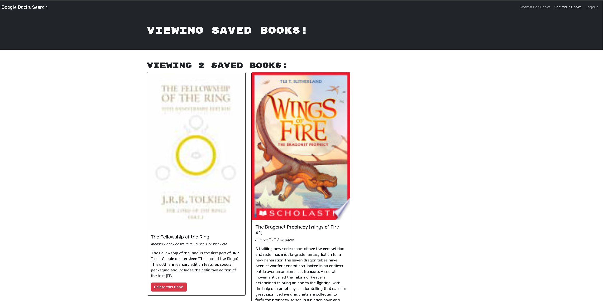

# Book Search Engine

## Description

I website where you can serach for a book using the google book search api and save them to a users profile.

## Installation

Download the files, open a terminal and run npm install and npm run develop from the root directory.

## Usage

A user can start by just searching for books and they will populate with an image, title, authors, and description. A user can sign up and create an account where they can save the searched books. The user can look at a list of their saved books and delete any books they don't want.


    ```md
    
    ```

## License

MIT